#### Modelling of electrical machine using Time Domain Multiconductor Transmission Line (MTL) Theory
*The purpose of the model is to understand the high-frequency transients due to switching pulses of frequency drive systems.*

I understand this repository requires a wiki to describe theories supporting the code. I'll complete it during my spare time. Feedback appreciated!
* Input files to this Mathematica model result from Finite Element Analysis.
* Cedrat Flux has been used for Finite Element Analysis of MTL parameters, i.e. inductances and capacitances.
* Capacitances of MTL conductors are calculated using the electrostatic solver, and the magnetostatic solver is used to calculate inductance.
* Python scripts run the solvers for each conductor geometric position and save parameters in Excel files.
* CSV files are the experimental measurements to verify the model.
* These Excel files are imported to Wolfram Mathematica for MTL modelling as illustrated below:

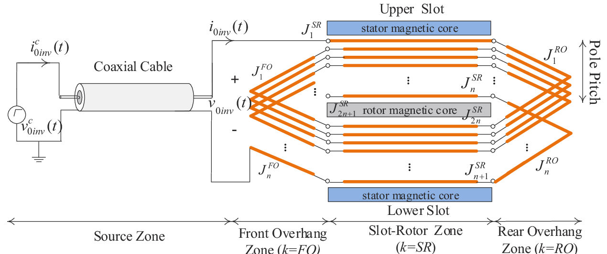
**Fig. 1** 
*Definition of different zones of electrical machine for parametrising and modelling transients with MTL*

#
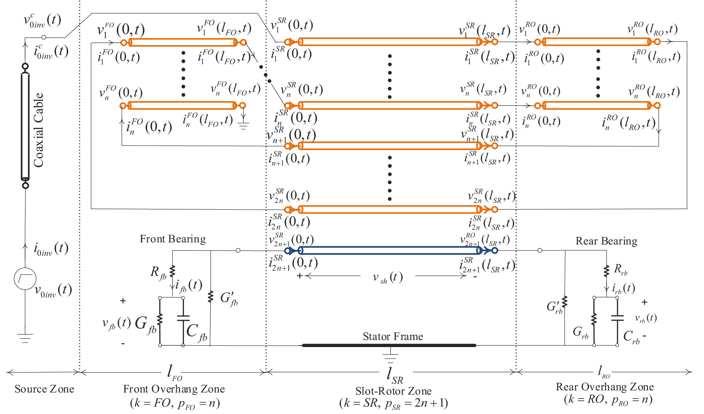
**Fig. 2** 
*MTL equations illustration*

* This repository contains Wolfram Mathematica code in three forms:
  1. Notebook file *MTL-131195-n=68.nb* if you access the Mathematica front-end.
  2. Wolfram script package file *MTL-131195-n=68.wl* can be used with the Wolfram Script free licence.
  3. The following images with the output waveforms are shown for only reading the code.

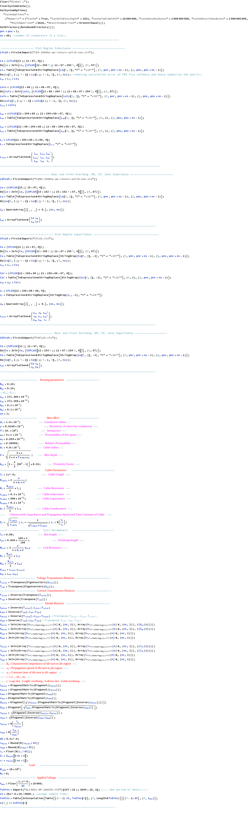

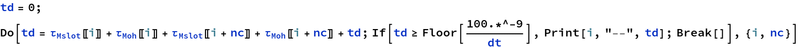

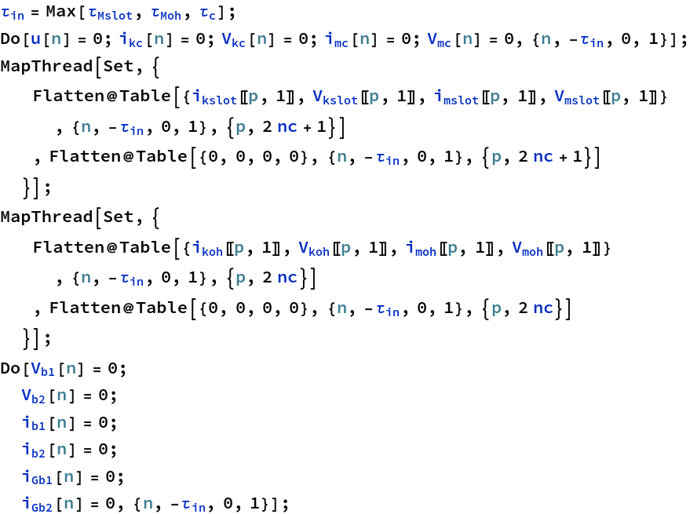

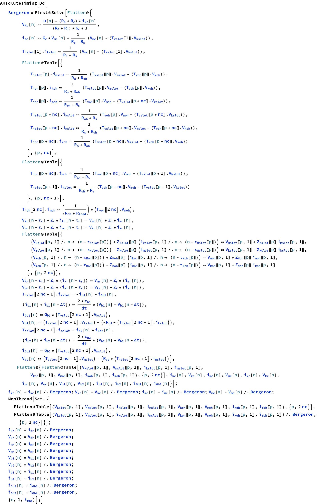

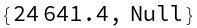

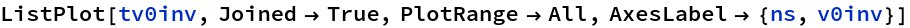

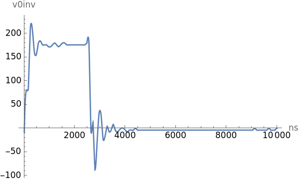

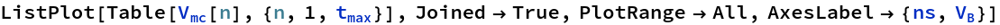

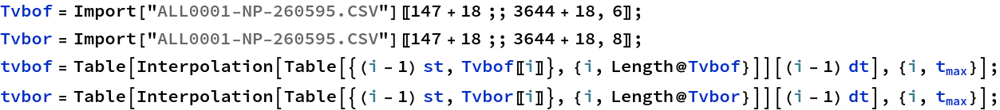

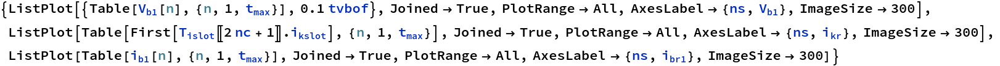

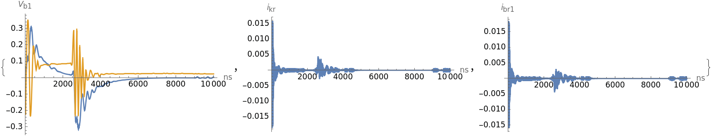

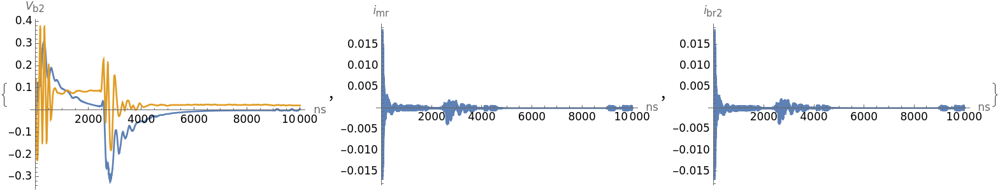

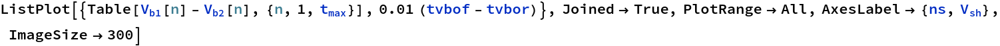

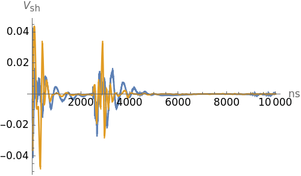

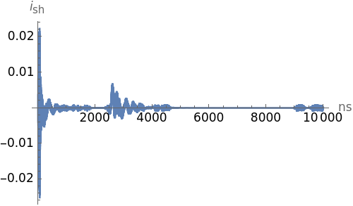

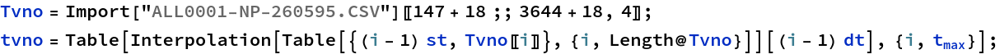

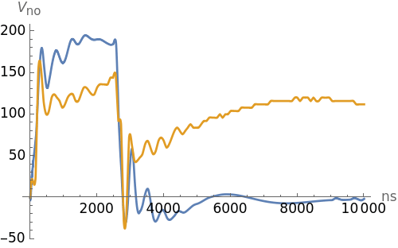

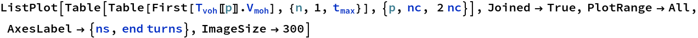

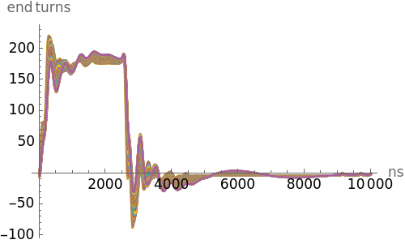

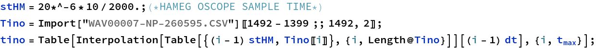

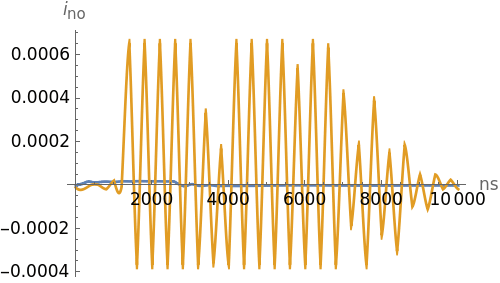

[Created with the Wolfram Language](http://www.wolfram.com/language/)